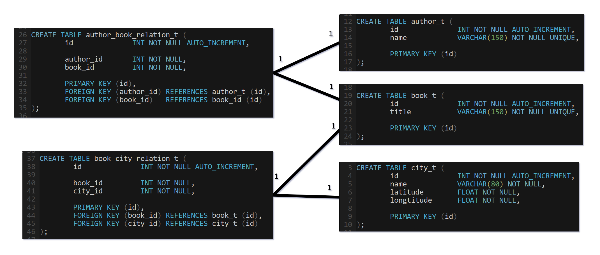

# Import

Der var mange ting der skulle importeres, og det skete i flere steps. Først
og fremmest, givent de queries der var krav om, kan man se at det er de følgende
ting man får brug for: Author, Book, City.
Til import af cities fik vi udleveret et dataset som skulle parses. Filen hedder
`cities15000.txt`, men den er faktisk en tabulator-separeret fil. Ved at kigge
lidt på filen, kan man finde de interessante kolonner:

|Kolonne|Værdi|
|---|---|
|3|Det engelske navn af en by|
|5|Latitude af en by|
|6|Longtitude af en by|
|15|Indbyggertallet af en by|

Der er ikke nogle af de queries der var krav om som har at gøre med
indbyggertallet af en by. Der er den problemstilling at der er flere byer
som har samme navn. Tilgangen til dette problem blev at sige, at i tilfælde
af navnekollisioner, fortolker man et bynavn til at hentyde til den by, hvori
der bor flest mennesker.
Til al import og parsing blev der brugt Python2 scripts.

For at importere byerne blev der lavet et script `city_parser.py`. Denne fil
indlæser `cities15000.txt` med `pandas` og importerer i en MariaDB-database via
`mysql.connector`-importen. I tilfælde af kollisioner overskriver den faktisk
latitude og longtitude med værdier parset som int. Hovsa!
Senere hen ville der blive brug for at parse byer som har navne der strækker
sig over flere ord, så tilgangen her blev at notere alle bynavne der er på
flere ord, og så at gemme det første ord i bynavnet som værende **interessant**.
Udsnit af `data_cities_lookup.py`:
```python
cities_maybe = {'Satara': 0, 'Yibin': 0, 'Rheinberg': 0, 'Dilling': 0, 'Kondapalle': 0, 'Constanta': 0,
...
'Lac': 0, 'Koprivnica': 0, 'Daura': 1, 'Smederevo': 0, 'Chur': 0, 'Panchla': 0, 'Behshahr': 0, 'Lat': '1',
'Nouakchott': 0, 'Malvern': '1', 'Wenling': 0, 'Basoko': 0, 'Lar': 0, 'Las': '1',
...
}
```
De interessante ord blev gemt i en fil ved navn `data_cities_lookup.py`. Man
vil så kunne bruge denne dictionary senere hen, for at vide, at når man støder
på et interessant ord som "Las", så kan det være at det er "Las Vegas".
Så er byerne blevet indsat, men man skal bruge deres id'er senere hen for at kunne
danne relationerne.
Der blev lavet et nyt Python2 script ved navn `import.py`. I den blev der
lavet en funktion som hedder `print_city_ids`, som bruges til at generere en
python dictionary med et bynavn og et SQL primary key int id. Denne dictionary
blev gemt som `data_cities_id.py`.

For at importere authors og books, er det ikke rigtigt muligt bare at parse
det fra en bogs indhold. Der er mange bøger hvori det ikke står, eller hvori
det står på en måde der ikke er i overensstemmelse med andre bøgers formater.
Istedet blev tilgangen at parse fra indholdet af den fil der hedder
`rdf-files.tar.bz2`. Dette viste sig at ikke være en bunke af almindelige
XML-filer, men et irreterende format der hedder RDF. Det blev nødvendigt
at bruge en python import som hedder `rdflib`. Det var ikke lige til at
finde ud af hvordan man kun skulle få fat i en `creator`, så tilgangen blev
at fortolke alle med navn som author. Det vil sige, at oversættere bliver
medregnet som co-creators i datasettet. RDF-filerne fulgte alle samme format
med et id i en undermappe `cache/epub/<id>/pg<id>.rdf`. Disse id-er
tilsvarer et fil-id fra gutenberg- datasettet, men gutenberg-bøgerne
kunne ligge under henholdsvis `books/<id>.txt` og `books/<id>/<id>.txt`.
Enkelte af dem havde et filnavn med bogstaver - disse blev ignoreret.

Der var flere filer i RDF-filsamlingen, så det måtte man tage sig af. Tilgangen
blev at sige, at forfatter- og bogparsningsdelen i `import.py` kun vil importere
hvis den kan finde en RDF-fils tilsvarende gutenberg bog-id.
Import af bøger og forfattere, og forfatter-bog-relationer skete i to forskellige
steps. Først for at indsætte dataen, og så for at lave opslag på dataen for at
få fat i id'erne og at lave relationerne.

Til sidst manglede kun parsing af bynavne og relationerne bogid:byid.
Python2-scriptet `city_finder.py` indlæser de i forvejen skabte dictionaries med
interessante bynavne, bynavne og by-id'er. Den går så igennem hver paragraf, og
checker om hvert ord er et interessant ord. Støder den på et interessant ord,
vil den checke om de næste 6 ord udgør et bynavn. Hvis ej, så check de næste
5 ord og så videre. Fandt den et bynavn på for eksempel 3 ord, vil den springe
tre ord frem i parsningsprocessen bagefter. Parseren fjerner irreterende
tegnsætningstegn udover bindestreger - disse bruges blandt andet i mange
mellemøstlige lande.
Der kommer en del false positives. I Tyrkiet findes der en by der hedder `Of`,
og i Polen findes der en by der hedder `Police`, og i Tjekkiet findes der en
by ved navn `Most`. Der er også false positives da `New York` ofte nævnes.
`New York` er ikke en by, så parseren finder `York` i det tilfælde. Når en by
er blevet fundet, vil parseren lave en relation i bog-by-relationstabellen.

Sådan blev author, author_book, book, book_city og city-tabellerne oprettet.
Senere hen viste det sig at være ret så langsomt at finde alle authors og
bøger der nævner en stor by som for eksempel `London`, så til optimering
blev der lavet en ekstra author-book-city-relationstabel. Der er mere
redundans, men nogle opslag blev langt hurtigere ved at bruge denne tabel
istedet. Senere viste det sig at query på authors og books der nævner en by via
JOINS var langsomme da der ikke var et index på city_t.name.
For at importere til de andre databaser, blev der eksporteret fra SQL til en
CSV, som de andre databaser kunne læse.

# Diagram

Dette er et diagram over hvordan databasestrukturen ser ud.


